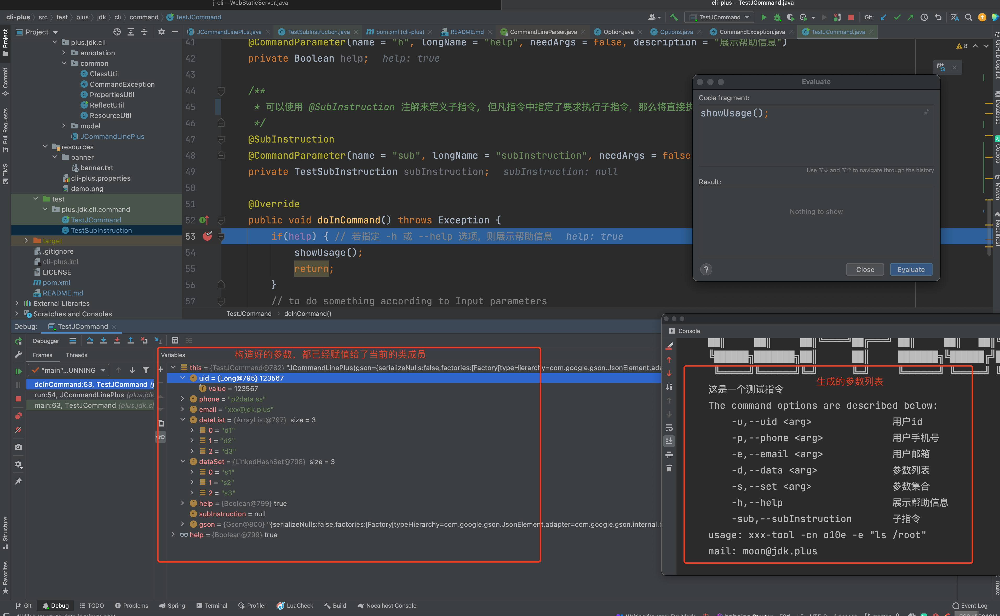

<p align="center">
    
</p>
<h3 align="center">Cli-Plus - Writing Command Line Instructions in Java</h3>
<p align="center">
    <a href="https://github.com/JDK-Plus/cli-plus/blob/master/LICENSE"></a>
    <a href="https://github.com/JDK-Plus/cli-plus/releases"></a>
    <a href="https://github.com/JDK-Plus/cli-plus/stargazers"></a>
    <a href="https://github.com/JDK-Plus/cli-plus/network/members"></a>
</p>
<p align="center">Cli-Plus is an open source framework for writing command-line commands in Java. It is simple, efficient, and easy to use, and can improve team work efficiency.</p>


# Introduction

This is a framework for writing command-line instruction sets using java

For detailed instructions, see: https://jdk.plus/pages/2ba02f/

- [中文文档](README-CN.md)

## Maven Dependencies

```xml
<dependency>
    <groupId>plus.jdk</groupId>
    <artifactId>cli-plus</artifactId>
    <version>1.1.2</version>
</dependency>
```

## How to define a command line and declare parameters

### How to define a command

```java
package plus.jdk.cli.command;

import plus.jdk.cli.JCommandLinePlus;
import plus.jdk.cli.annotation.CommandLinePlus;
import plus.jdk.cli.annotation.CommandParameter;
import plus.jdk.cli.annotation.SubInstruction;

import java.util.List;
import java.util.Set;

@CommandLinePlus(description = "This is a test command line")
public class TestJCommand extends JCommandLinePlus {

    /**
     * You can use the required option to specify that this parameter must be entered.
     * Call the implemented validate() function to validate the parameters
     */
    @CommandParameter(name = "u", longName = "uid", needArgs = true, description = "用户id", required = true)
    private Long uid;

    @CommandParameter(name = "p", longName = "phone", needArgs = true, description = "user phone")
    private String phone;

    /**
     * For easy option，you can use, -<name> or --<longName> declare parameters，for example， -e xxx@jdk.plus, or --email xxx@jdk.plus
     */
    @CommandParameter(name = "e", longName = "email", needArgs = true, description = "user email")
    private String email;

    /**
     * You can use multiple options to specify the list，for example : -d d1 -d d2 --data d3
     */
    @CommandParameter(name = "d", longName = "data", needArgs = true, description = "args list")
    private List<String> dataList;

    /**
     * You can use multiple options to specify the set，for example : -s d1 -s d2 --set d3
     */
    @CommandParameter(name = "s", longName = "set", needArgs = true, description = "args set")
    private Set<String> dataSet;

    /**
     * For options that do not require parameters，You can use Boolean type to receive，
     * For example, specify -h or --help, the value will be assigned to true, otherwise false
     */
    @CommandParameter(name = "h", longName = "help", needArgs = false, description = "display help information")
    private Boolean help;

    /**
     * You can use @SubInstruction annotations to define subcommands, 
     * whenever the instruction specifies that the sub-instruction is required to be executed，
     * then the logic in the sub-instruction will be executed directly，
     * no longer execute the task in the current command
     */
    @SubInstruction
    @CommandParameter(name = "sub", longName = "subInstruction", needArgs = false, description = "this is a subcommands")
    private TestSubInstruction subInstruction;

    @Override
    public void doInCommand() throws Exception {
        if(help) { // Show help if the -h or --help option is specified
            showUsage();
            return;
        }
        
        validate();

        // to do something according to Input parameters
        // which has been assigned to a member variable
    }

    public static void main(String[] args) throws Exception {
        TestJCommand testCommand = new TestJCommand();
        testCommand.run(args);
    }
}
```

### Execute a custom set of instructions：

```bash
java -jar xxx.jar -u 123567 -p "p2data ss" --email xxx@jdk.plus -h -s s1 -s s2 --set s3 -d d1 -d d2 --data d3
```

### According to the parameter passing described above, the effect of execution is as follows



### About some default configuration files

You need to specify `cli-plus.properties` in your project `resources` directory.

> Of course, it is also possible to not specify, and the default configuration provided by us will be used.

```bash
plus.jdk.help.header.welcome=Welcome to use cli-plus
plus.jdk.help.header.description=The command options are described below:
plus.jdk.help.footer.description=usage: xxx-tool -cn xx -e "ls /root"
plus.jdk.help.footer.contact=mail: moon@jdk.plus
```

### How to display help information for commands and subcommands

Calling the encapsulated `showUsage` method can generate and print help information, for example:


> Of course, if you are not satisfied with this style, you can override the `showUsage` method to customize 
> the help information for your instruction set

## About encapsulation of instructions use `shell`

```shell
#!/bin/bash

# 指定运行时的JAVA_HOME
#JAVA_HOME=${HOME}/.biz-tools/java-se-8u41-ri
#PATH=${JAVA_HOME}/bin:$PATH

if ! which java > /dev/null ; then
    echo "jdk is not installed, please install the version above 1.8"
    exit
fi

JAVA_VERSION=$(java -version 2>&1 | sed '1!d' | sed -e 's/"//g' | awk '{print $3}')

if [[ ! "${JAVA_VERSION}" =~ ^1.8.0.* ]]; then
    echo "The jdk version must be greater than or equal to 1.8, please check the environment configuration"
    exit
fi

TOOLS_JAR=$(dirname "$0")/tools.jar

# shellcheck disable=SC2046
java -jar "${TOOLS_JAR}" "$@" -c $(dirname "$0")/conf/config.properties
```
## How to read your config

We encapsulate the `initializationConfig` function to help you read the configuration. This function can be used with 
the `PropertiesValue` annotation to convert the configuration content into the configuration of the entity class.

### How to define entity classes

```java
package plus.jdk.cli.model;

import lombok.Data;
import plus.jdk.cli.annotation.PropertiesValue;

@Data
public class CliHelpModel {

    @PropertiesValue("plus.jdk.help.header.welcome")
    private String headerWelcome;

    /**
     * You can use the resource and path parameters to specify the banner location to output
     */
    @PropertiesValue(value = "plus.jdk.help.header.banner", resource = true, path = "banner/banner.txt")
    private String banner;

    
    @PropertiesValue("plus.jdk.help.header.description")
    private String headerDesc;

    @PropertiesValue("plus.jdk.help.footer.description")
    private String footerDesc;

    @PropertiesValue("plus.jdk.help.footer.contact")
    private String footerContact;
}
```
As you can see, the content in the configuration will assign values to the member variables of the entity class according to your annotation decoration

### An example of reading a configuration file

```java
import static plus.jdk.cli.common.PropertiesUtil.initializationConfig;
//...
CliHelpModel cliHelpModel = initializationConfig(CliHelpModel.class, "cli-plus.properties", true);
//...
```

## Add support for special types

If your input parameters need to specify some custom types (currently only `Boolean`, `Long`, `String`, `Integer` are supported).

### Customize your own type adapter

You can customize the related serialization functions by implementing the `ITypeAdapter` interface. 

An example is as follows, the following is an example of the serialization implementation of the `Long` type:

```java
package plus.jdk.cli.type.adapter;

import com.google.gson.TypeAdapter;

public class LongTypeAdapter implements ITypeAdapter<Long> {
    @Override
    public Long deserialize(String dataStr) {
        if(dataStr == null) {
            return null;
        }
        return Long.parseLong(dataStr);
    }

    @Override
    public String serialize(Long data) {
        if(data == null) {
            return null;
        }
        return String.valueOf(data);
    }
}
```

### Register the implemented adapter

```java
@CommandLinePlus(description = "this is a test command")
public class TestJCommand extends JCommandLinePlus {
    
    // ...
    
    public static void main(String[] args) throws Exception {
        TestJCommand testCommand = new TestJCommand();
        // Register your own implemented adapter component before completing the call
        Options.registerTypeAdapter(Long.class, new LongTypeAdapter()); 
        testCommand.run(args);
    }
}
```

